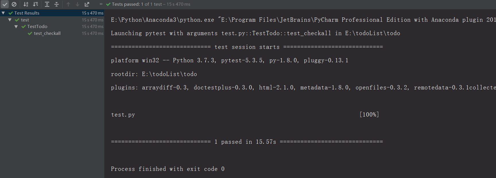
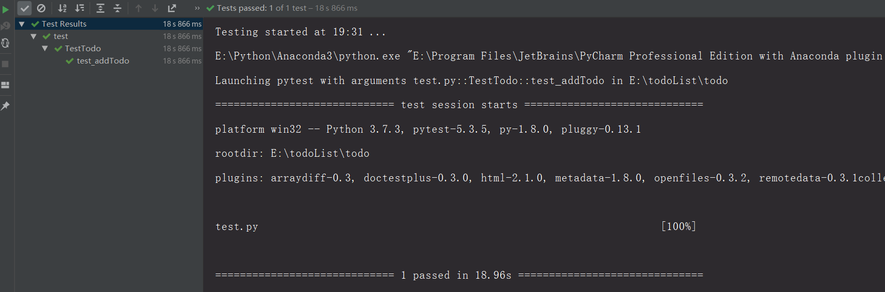
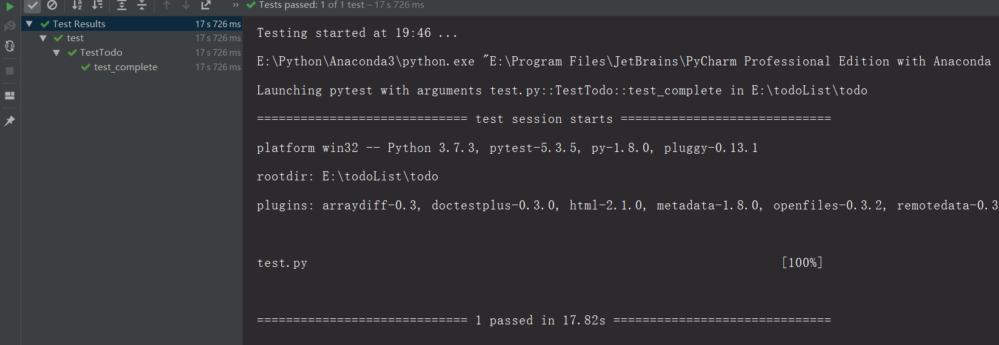
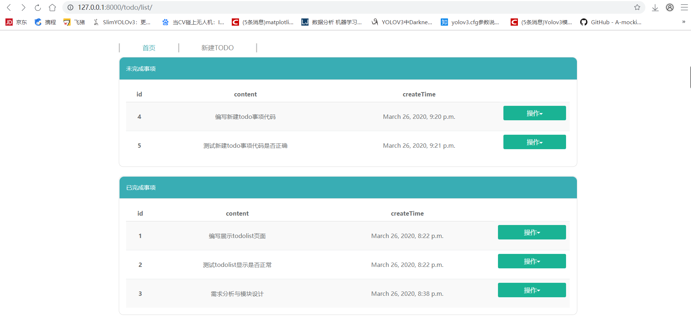
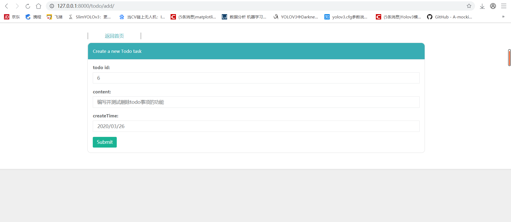
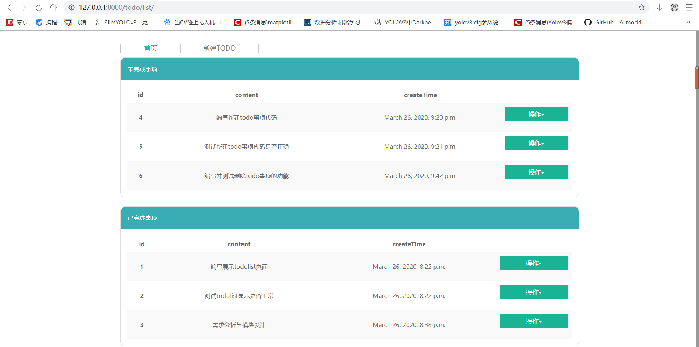
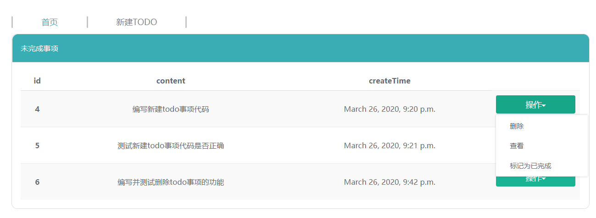
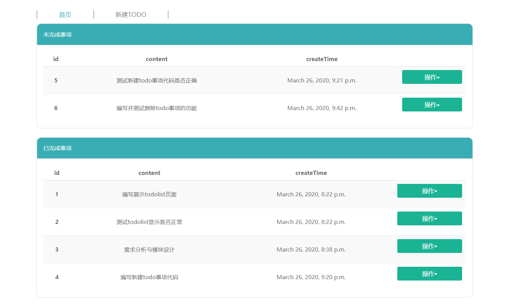

# todoList
西交2020春敏捷web开发课后作业
## 作业内容
#####
    1 渲染一个todo List
    2 可以添加新的 todo 事项
    3 可以区分已完成和未完成事项
    4 可以将未完成的事项标记为已完成
#### 2020年4月2日在原来todoList代码基础上完成自动化测试，提交新的结果，完成第六课的作业
#####
    - 渲染所有待办事项(判断待办事项的长度即可)
    - 可以添加新的待办事项
    - 可以完成待办事项

## 实现细节
##### 
    $ python 3.7
    $ django 2.2
    $ sqlite3数据库
自动化测试工具  
#####
    $ unittest框架+selenium
    $ 测试文件路径为todo/test.py
    
使用了Restful API 
#### 一级路由
#####
    $ path('todo/',include('todo.urls'))
#### 二级路由
#####
    $ path('list/',views.index,name = "todolist")
    $ path('add/',views.add,name = 'add')
    $ path('select/<int:todo_id>/',views.select,name='select')
    $ path('delete/<int:todo_id>/',views.delete,name='delete')
    $ path('complete/<int:todo_id>/', views.complete, name = 'complete')
### 自动化测试结果截图
渲染所有待办事项(判断待办事项的长度即可)  

可以添加新的待办事项

可以完成待办事项

### 结果截图
##### 返回所有Todo任务,区分已完成和未完成的todo事项

  
##### 创建一个新的Todo任务  

##### 执行结果

##### 将未完成的todo事项标记为已完成

##### 执行结果

